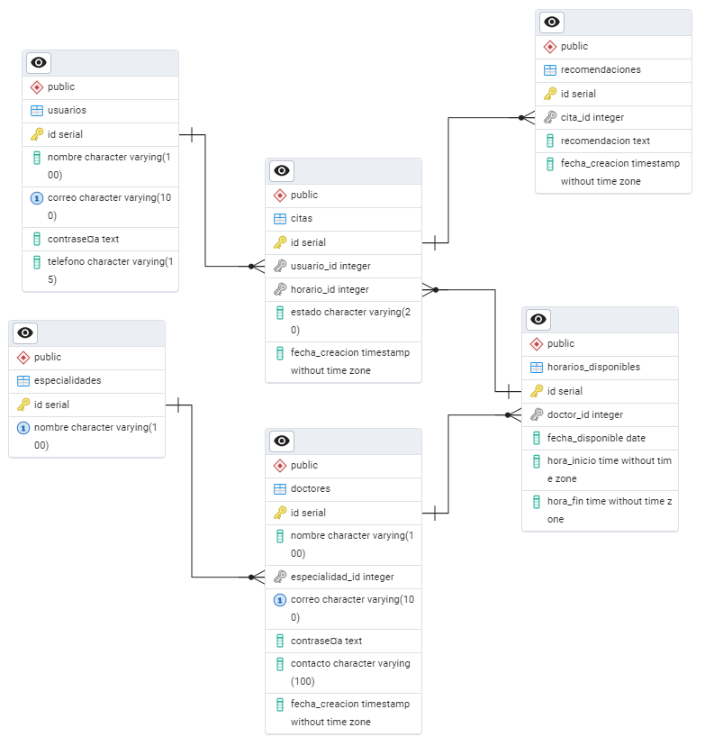

# Estructura de Base de Datos - Gestión de Citas Médicas

## 📌 Descripción
Esta carpeta contiene la estructura de la base de datos para el sistema de gestión de citas médicas.

## 📌 Requisitos
- PostgreSQL 14+
- pgAdmin (opcional)

## 📌 Instalación

### 🔹 Restaurar desde un archivo `.backup`
   ```bash
   pg_restore -U usuario -d gestion_citas_medicas /ruta/del/archivo/DB_Estructura.backup
   ```
Si la DB ya existe y se desea sobreescribir:
   ```bash
   pg_restore -U usuario -d gestion_citas_medicas --clean --if-exists /ruta/del/archivo/DB_Estructura.backup
   ```
 📌 **Restauración desde pgAdmin 4:**
1. Abre **pgAdmin 4** y selecciona tu servidor.
2. **Crea una base de datos nueva** (`gestion_citas_medicas`).
3. **Haz clic derecho sobre la base de datos** y selecciona **Restore...**.
4. En la ventana emergente:
   - **Formato**: Selecciona **Custom o Tar**.
   - **Filename**: Busca y selecciona el archivo `.backup`.

## 📌 Tablas y Relaciones

### 📂 Tabla `especialidades`
Almacena las especialidades médicas disponibles en el sistema.

### 📂 Tabla `doctores`
Almacena la información de los doctores registrados en el sistema.

### 📂 Tabla `usuarios`
Almacena los datos de los pacientes registrados en el sistema.

### 📂 Tabla `horarios_disponibles`
Define los horarios en los que un doctor puede recibir citas.

### 📂 Tabla `citas`
Registra las citas médicas de los pacientes con los doctores.

### 📂 Tabla `recomendaciones_medicas`
Permite que los doctores registren recomendaciones para los pacientes después de una cita.

## 📌 Relaciones Claves y Flujo de Datos
- **Usuarios (`usuarios`)** almacena los pacientes.
- **Doctores (`doctores`)** almacena los médicos y está relacionado con **especialidades (`especialidades`)**.
- **Horarios Disponibles (`horarios_disponibles`)** define los turnos de atención de cada doctor.
- **Citas (`citas`)** relaciona a los usuarios con los horarios disponibles de los doctores.
- **Recomendaciones Médicas (`recomendaciones_medicas`)** está relacionada con las citas y almacena observaciones del doctor.

 📌 Diagrama Entidad-Relación




